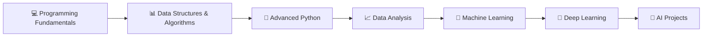

# 👋 Hey there, I'm Arjun Yadav!

### 💻 CSE Student | 🤖 Learning AI & Machine Learning | 🚀 Building & Exploring

<p align="left">
  
</p>

---

## 🚀 About Me

```python
class ArjunYadav:

    def __init__(self):
        self.role = "Computer Science Engineering Student"
        self.current_focus = ["Artificial Intelligence", "Machine Learning"]
        self.interests = [
            "Software Development",
            "AI & ML",
            "Problem Solving",
            "Building Projects"
        ]

    def say_hi(self):
        print("Thanks for visiting my GitHub profile!")
```

* 🎓 I'm a **Computer Science Engineering student**
* 🤖 Currently learning **Artificial Intelligence & Machine Learning**
* 💻 Exploring **software development and real-world projects**
* 🌱 Continuously improving my programming and problem-solving skills
* 🚀 Interested in building projects that combine **AI + Software Development**
* 📫 Always open to learning, collaboration, and new opportunities

---

## 🧠 Currently Learning

<p align="left">


</p>

### 🤖 AI & Machine Learning Journey

```text
Python Fundamentals       ██████████  Learning
Data Structures           ███████░░░  Learning
Machine Learning          ████░░░░░░  Beginner
Artificial Intelligence   ████░░░░░░  Exploring
Deep Learning             ██░░░░░░░░  Coming Soon
```

---

## 🛠️ Tech Stack

### 💻 Programming Languages

<p align="left">

</p>

### 🌐 Web Technologies

<p align="left">

</p>

### 🗄️ Databases & Tools

<p align="left">

</p>

---

# 📊 GitHub Statistics

<p align="center">


</p>

<p align="center">


</p>

---

# 🚀 Featured Projects

### 🧠 Crime Record Management System

A database-driven system designed to manage and organize crime records efficiently.

**Technologies:**

`MySQL` `JavaScript` `Database Management`

---

### ❤️ Heart Disease Prediction

A machine learning project focused on predicting the possibility of heart disease using patient-related data.

**Concepts:**

`Machine Learning` `Data Analysis` `Prediction Models`

---

### 🔍 Search Algorithm Performance Predictor

An AI/ML-based project concept that analyzes different search algorithms and predicts the most suitable algorithm based on problem conditions.

**Algorithms & Concepts:**

`BFS` `DFS` `A* Algorithm` `Machine Learning`

---

### 🎬 Netflix Clone

A web development project inspired by the Netflix user interface.

**Technologies:**

`HTML` `CSS` `JavaScript`

---

## 🗺️ My Learning Roadmap



---

## 🎯 2026 Goals

* [x] Build my GitHub profile
* [x] Start learning Python and programming fundamentals
* [ ] Strengthen Data Structures & Algorithms
* [ ] Learn Machine Learning fundamentals
* [ ] Build multiple AI/ML projects
* [ ] Learn Deep Learning
* [ ] Contribute to open-source projects
* [ ] Build a strong software engineering portfolio

---

## 🧩 What I'm Interested In

```text
🤖 Artificial Intelligence
🧠 Machine Learning
💻 Software Development
📊 Data Science
⚡ Algorithms
🚀 Building Real-World Projects
```

---

## 📈 My Development Philosophy

> **Learn → Build → Break → Fix → Improve → Repeat**

I believe the best way to learn technology is by building projects, solving problems, making mistakes, and continuously improving.

---

## 🤝 Connect With Me

<p align="left">

<a href="https://github.com/Arjun-dev418">

</a>

<a href="mailto:YOUR_EMAIL">

</a>

</p>

---

<p align="center">

### ⭐ *"The journey of becoming an engineer is built one project, one bug, and one lesson at a time."*

<br>

**Thanks for visiting my profile! 🚀**

</p>
